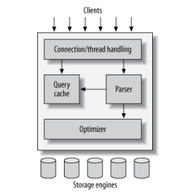

# MySQL Architecture and History 
`Chapter One`
#### This chapter provides a high-level overview of 
1. The MySQL server architecture 
2. The major differences between the storage engines
   1. why those differences are important

### MySQL logical architecture

   

1. Connection handling, authentication and security like any client/server tools
2. Query parsing, analysis, optimization, caching, built-in functions, procedures, triggers and views.
3. Storage engines, responsible for data storing and retrieving.
   >The server communicates with these engines using **Storage Engine API** 
   > to hide all the differences and make them transparent to the query layer.

### Connection Management and Security:
* Authentication is based on username, originating host, and password.
* Then the server verifies whether the user has privilege for each query he issues or not.

### Optimization and Execution
* MySql parses queries to create internal structure **the parse tree**
* Then applies a variety of optimization
  * Rewriting the query
  * Determining the order in which it will read the tables
  * Choosing indexes that will be used
  > you can pass keys to optimization in the query to help and affecting the process of decision-making.
* The optimizer asks the storage engine about some of its capabilities and the cost of certain operations, and
  for statistics on the table data.
* Before even parsing the query, though, the server consults the query cache, which can
  store only SELECT statements, along with their result sets, to be retrieved directly without parsing
