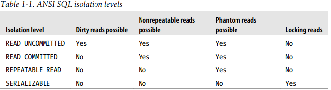

## Transactions
A transaction is a group of SQL queries that are treated
**atomically**, as a single unit of work.

`It’s all or nothing`

> START TRANSACTION
> 
> // some queries
> 
> COMMIT or ROLLBACK 

*Transactions aren’t enough unless the system passes the ACID test*

### ACID
These are tightly related criteria that
a well-behaved transaction processing system must meet

> The downside of this extra security is that the database server has to do more work, which means more HW resources.

#### Atomicity `it’s all or nothing`
A transaction must function as a single indivisible unit of work so that the entire
transaction is either applied or rolled back

#### Consistency
The database should always move from one consistent state to the next.
* Ex: After subtracting $200 from an account we must found these $200 in another place in DB, So the whole amount before and after the transaction should be consistent.

#### Isolation
The results of a transaction are usually invisible to other transactions until the
transaction is complete.

#### Durability
Once committed, a transaction’s changes are permanent regardless of any system crash for example.

## Isolation Levels
Specific rules for which changes are and aren’t visible inside and outside a transaction

>Lower isolation levels typically allow higher concurrency and have lower
overhead

#### READ UNCOMMITTED
  * Transactions can view the results of uncommitted transactions.
  * Leads to `dirty reads` which is reading uncommitted changes from other concurrent transactions.
> Transaction A could see updates from B even B isn't committed.
#### READ COMMITTED
  * Literally implements the definition of Isolation
  * Allows `nonrepeatable reads`.
    * Nonrepeatable reads: Two reads within transaction and two different data of specific row.
> Transaction A will read different data before and after B is committed.
#### REPEATABLE READ `default transaction isolation level for MySQL`
* Solves the problems that READ COMMITTED allows.
* It guarantees that any rows a transaction reads will “look the same” in subsequent reads within th same transaction.
* Allows `Phantom reads`.
  * Phantom reads: Two reads within transaction and two different row collections.
#### SERIALIZABLE
* The highest level of isolation, Places a lock on every row it reads.
* solves the phantom read problem by forcing transactions to be ordered so that they can’t possibly conflict.

   

### Deadlocks
 When two or more transactions are mutually holding and requesting locks on the same resources, creating a cycle of dependencies
* The way InnoDB currently handles deadlocks is to roll back the transaction that  has the fewest exclusive row locks (an approximate metric for which will be the easiest to roll back).
* Lock behavior and order are storage engine–specific, so some storage engines might deadlock on a certain sequence of statements even though others won’t.
> Deadlocks
have a dual nature: some are unavoidable because of true data conflicts, and some are
caused by how a storage engine works.

### Transaction Logging
Transaction logging helps make transactions more efficient.
1. Instead of updating the tables on disk each time a change occurs.
2. The storage engine can change its in-memory copy of the data.
3. The storage engine can then write a record of the change to the transaction log.
4. If there’s a crash after the update is written to the transaction log but before the changes are made to the data itself, the storage engine can still recover the changes upon restart.

### Transactions in MySQL
MySQL provides two transactional storage engines: InnoDB and NDB Cluster.

#### AUTOCOMMIT
MySQL operates in AUTOCOMMIT mode by default. This means that unless you’ve explicitly begun a transaction, it automatically executes each query in a separate transaction.
> You can enable or disable AUTOCOMMIT by `SET AUTOCOMMIT = 1`
* When you run with `AUTOCOMMIT = 0`, you are always in a transaction, until you issue a COMMIT or ROLLBACK. MySQL then  starts a new transaction immediately.
  * If you issued any DDL command MySQL will force commit the old transaction and start new one.
#### Implicit and Explicit Locking
* Implicit Locking: Set and released automatically during the transaction
* Explicit Locking: Set and released by the user, Gives higher security level for previnting Deadlocks.
